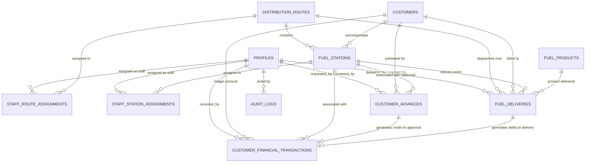

# PostgreSQL Database Design
## Oil Distribution Management & Analytics System

**Target Platform:** PostgreSQL via Supabase  
**Design Pattern:** Relational (3NF), Append-Only Financial & Delivery Ledger, Role-Based & Assignment-Based Row Level Security (RLS)

---

## 1. Custom Types (PostgreSQL Enums)

```sql
-- Role definitions
CREATE TYPE public.user_role AS ENUM ('manager', 'staff');

-- Advance request workflow states
CREATE TYPE public.advance_status AS ENUM ('pending', 'approved', 'rejected');

-- Financial ledger entry classification
CREATE TYPE public.financial_entry_type AS ENUM ('debit', 'credit');

-- Financial transaction event types
CREATE TYPE public.financial_transaction_type AS ENUM (
    'fuel_delivery_charge',  -- Debit: customer owes for fuel delivery
    'payment',               -- Credit: direct payment made by customer
    'approved_advance',      -- Credit: manager-approved customer advance
    'adjustment'             -- Debit/Credit: manager correction/adjustment
);

-- Delivery lifecycle status (TBD: pending operational workflow confirmation)
CREATE TYPE public.delivery_status AS ENUM ('in_transit', 'delivered', 'cancelled');
```

---

## 2. Table Specifications

### 2.1. `public.profiles`
User metadata extending Supabase `auth.users`.

| Column | Data Type | Constraints | Description |
| :--- | :--- | :--- | :--- |
| `id` | `UUID` | `PRIMARY KEY, REFERENCES auth.users(id) ON DELETE CASCADE` | Matches Supabase Auth user ID |
| `email` | `TEXT` | `NOT NULL UNIQUE` | User email address |
| `full_name` | `TEXT` | `NOT NULL` | User full name |
| `role` | `user_role` | `NOT NULL DEFAULT 'staff'` | 'manager' or 'staff' |
| `phone` | `TEXT` | `NULL` | [TBD: Phone format validation] |
| `is_active` | `BOOLEAN` | `NOT NULL DEFAULT true` | Active flag for access |
| `created_at` | `TIMESTAMPTZ` | `NOT NULL DEFAULT now()` | Record creation timestamp |
| `updated_at` | `TIMESTAMPTZ` | `NOT NULL DEFAULT now()` | Record last updated timestamp |

* **Unique Constraints:** `UNIQUE (email)`
* **Indexes:** `idx_profiles_role` ON `(role)`, `idx_profiles_is_active` ON `(is_active)`

---

### 2.2. `public.distribution_routes`
Territories and routes along which fuel is dispatched to stations.

| Column | Data Type | Constraints | Description |
| :--- | :--- | :--- | :--- |
| `id` | `UUID` | `PRIMARY KEY DEFAULT gen_random_uuid()` | Unique route identifier |
| `route_code` | `TEXT` | `NOT NULL UNIQUE` | Unique code (e.g., 'RT-NORTH-01') |
| `name` | `TEXT` | `NOT NULL` | Human-readable route name |
| `description` | `TEXT` | `NULL` | [TBD: Route path/waypoints details] |
| `is_active` | `BOOLEAN` | `NOT NULL DEFAULT true` | Active status of route |
| `created_by` | `UUID` | `REFERENCES profiles(id) ON DELETE SET NULL` | Manager who created route |
| `created_at` | `TIMESTAMPTZ` | `NOT NULL DEFAULT now()` | Creation timestamp |
| `updated_at` | `TIMESTAMPTZ` | `NOT NULL DEFAULT now()` | Update timestamp |

* **Unique Constraints:** `UNIQUE (route_code)`
* **Indexes:** `idx_routes_active` ON `(is_active)`

---

### 2.3. `public.customers`
Client entities operating fuel stations or purchasing fuel.  
**Critical Requirement:** Contains **NO** manually editable balance column. Balances are computed exclusively from the financial transaction ledger.

| Column | Data Type | Constraints | Description |
| :--- | :--- | :--- | :--- |
| `id` | `UUID` | `PRIMARY KEY DEFAULT gen_random_uuid()` | Unique customer identifier |
| `customer_code` | `TEXT` | `NOT NULL UNIQUE` | Unique business code (e.g., 'CUST-001') |
| `name` | `TEXT` | `NOT NULL` | Customer / Contact name |
| `business_name` | `TEXT` | `NULL` | Registered company/station group name [TBD] |
| `email` | `TEXT` | `NULL` | Contact email |
| `phone` | `TEXT` | `NULL` | Contact phone |
| `billing_address` | `TEXT` | `NULL` | Billing address [TBD] |
| `credit_limit` | `NUMERIC(14,2)` | `NOT NULL DEFAULT 0.00 CHECK (credit_limit >= 0)` | Maximum credit permitted [TBD] |
| `is_active` | `BOOLEAN` | `NOT NULL DEFAULT true` | Active status |
| `created_by` | `UUID` | `REFERENCES profiles(id) ON DELETE SET NULL` | Creator profile |
| `created_at` | `TIMESTAMPTZ` | `NOT NULL DEFAULT now()` | Creation timestamp |
| `updated_at` | `TIMESTAMPTZ` | `NOT NULL DEFAULT now()` | Update timestamp |

* **Unique Constraints:** `UNIQUE (customer_code)`
* **Indexes:** `idx_customers_is_active` ON `(is_active)`, `idx_customers_name` ON `(name)`

---

### 2.4. `public.fuel_stations`
Fuel retail and dispensing points along routes.

| Column | Data Type | Constraints | Description |
| :--- | :--- | :--- | :--- |
| `id` | `UUID` | `PRIMARY KEY DEFAULT gen_random_uuid()` | Unique station identifier |
| `station_code` | `TEXT` | `NOT NULL UNIQUE` | Unique station code (e.g., 'STN-101') |
| `name` | `TEXT` | `NOT NULL` | Station display name |
| `route_id` | `UUID` | `NOT NULL REFERENCES distribution_routes(id) ON DELETE RESTRICT` | Route where station is located |
| `customer_id` | `UUID` | `NOT NULL REFERENCES customers(id) ON DELETE RESTRICT` | Customer owning/operating station |
| `address` | `TEXT` | `NULL` | Physical address [TBD] |
| `gps_latitude` | `NUMERIC(9,6)` | `NULL` | Latitude coordinate [TBD] |
| `gps_longitude` | `NUMERIC(9,6)` | `NULL` | Longitude coordinate [TBD] |
| `contact_person` | `TEXT` | `NULL` | On-site manager/contact [TBD] |
| `contact_phone` | `TEXT` | `NULL` | On-site contact phone [TBD] |
| `is_active` | `BOOLEAN` | `NOT NULL DEFAULT true` | Active status |
| `created_by` | `UUID` | `REFERENCES profiles(id) ON DELETE SET NULL` | Creator |
| `created_at` | `TIMESTAMPTZ` | `NOT NULL DEFAULT now()` | Creation timestamp |
| `updated_at` | `TIMESTAMPTZ` | `NOT NULL DEFAULT now()` | Update timestamp |

* **Unique Constraints:** `UNIQUE (station_code)`
* **Indexes:** `idx_stations_route` ON `(route_id)`, `idx_stations_customer` ON `(customer_id)`, `idx_stations_active` ON `(is_active)`

---

### 2.5. `public.staff_route_assignments`
Enforces staff routing permissions. Managers have universal access; staff have access restricted to assigned routes.

| Column | Data Type | Constraints | Description |
| :--- | :--- | :--- | :--- |
| `id` | `UUID` | `PRIMARY KEY DEFAULT gen_random_uuid()` | Unique assignment identifier |
| `staff_id` | `UUID` | `NOT NULL REFERENCES profiles(id) ON DELETE CASCADE` | Staff profile |
| `route_id` | `UUID` | `NOT NULL REFERENCES distribution_routes(id) ON DELETE CASCADE` | Assigned route |
| `assigned_by` | `UUID` | `REFERENCES profiles(id) ON DELETE SET NULL` | Manager making the assignment |
| `assigned_at` | `TIMESTAMPTZ` | `NOT NULL DEFAULT now()` | Assignment timestamp |

* **Unique Constraints:** `UNIQUE (staff_id, route_id)`
* **Indexes:** `idx_staff_route_staff` ON `(staff_id)`, `idx_staff_route_route` ON `(route_id)`

---

### 2.6. `public.staff_station_assignments`
Enforces staff station permissions.

| Column | Data Type | Constraints | Description |
| :--- | :--- | :--- | :--- |
| `id` | `UUID` | `PRIMARY KEY DEFAULT gen_random_uuid()` | Unique assignment identifier |
| `staff_id` | `UUID` | `NOT NULL REFERENCES profiles(id) ON DELETE CASCADE` | Staff profile |
| `station_id` | `UUID` | `NOT NULL REFERENCES fuel_stations(id) ON DELETE CASCADE` | Assigned fuel station |
| `assigned_by` | `UUID` | `REFERENCES profiles(id) ON DELETE SET NULL` | Manager making the assignment |
| `assigned_at` | `TIMESTAMPTZ` | `NOT NULL DEFAULT now()` | Assignment timestamp |

* **Unique Constraints:** `UNIQUE (staff_id, station_id)`
* **Indexes:** `idx_staff_station_staff` ON `(staff_id)`, `idx_staff_station_station` ON `(station_id)`

---

### 2.7. `public.fuel_products`
Master catalog of oil / fuel grades.

| Column | Data Type | Constraints | Description |
| :--- | :--- | :--- | :--- |
| `id` | `UUID` | `PRIMARY KEY DEFAULT gen_random_uuid()` | Unique product identifier |
| `product_code` | `TEXT` | `NOT NULL UNIQUE` | Code (e.g. 'DSL', 'RON-95') |
| `name` | `TEXT` | `NOT NULL` | Product name (e.g. 'Diesel 50ppm') |
| `current_unit_price` | `NUMERIC(10,2)` | `NOT NULL CHECK (current_unit_price >= 0)` | Active price per unit of measure |
| `unit_of_measure` | `TEXT` | `NOT NULL DEFAULT 'Liters'` | Unit (Liters, Gallons) |
| `is_active` | `BOOLEAN` | `NOT NULL DEFAULT true` | Availability status |
| `created_by` | `UUID` | `REFERENCES profiles(id) ON DELETE SET NULL` | Creator |
| `created_at` | `TIMESTAMPTZ` | `NOT NULL DEFAULT now()` | Creation timestamp |
| `updated_at` | `TIMESTAMPTZ` | `NOT NULL DEFAULT now()` | Update timestamp |

* **Unique Constraints:** `UNIQUE (product_code)`

---

### 2.8. `public.fuel_deliveries`
Historical fuel delivery transactions. Preserves physical dispatch and meter records.

| Column | Data Type | Constraints | Description |
| :--- | :--- | :--- | :--- |
| `id` | `UUID` | `PRIMARY KEY DEFAULT gen_random_uuid()` | Unique delivery identifier |
| `delivery_number` | `TEXT` | `NOT NULL UNIQUE` | Auto-generated or reference delivery # |
| `delivery_date` | `TIMESTAMPTZ` | `NOT NULL DEFAULT now()` | Date & time fuel delivered |
| `route_id` | `UUID` | `NOT NULL REFERENCES distribution_routes(id) ON DELETE RESTRICT` | Associated route |
| `station_id` | `UUID` | `NOT NULL REFERENCES fuel_stations(id) ON DELETE RESTRICT` | Receiving fuel station |
| `customer_id` | `UUID` | `NOT NULL REFERENCES customers(id) ON DELETE RESTRICT` | Billed customer |
| `fuel_product_id` | `UUID` | `NOT NULL REFERENCES fuel_products(id) ON DELETE RESTRICT` | Product delivered |
| `quantity_liters` | `NUMERIC(12,2)` | `NOT NULL CHECK (quantity_liters > 0)` | Volume delivered in liters |
| `unit_price` | `NUMERIC(10,2)` | `NOT NULL CHECK (unit_price >= 0)` | Locked snapshot price at delivery time |
| `total_amount` | `NUMERIC(14,2)` | `NOT NULL CHECK (total_amount >= 0)` | quantity_liters * unit_price |
| `status` | `delivery_status` | `NOT NULL DEFAULT 'delivered'` | Delivery workflow state [TBD] |
| `truck_plate_number` | `TEXT` | `NULL` | Tanker truck registration [TBD] |
| `driver_name` | `TEXT` | `NULL` | Tanker truck driver [TBD] |
| `meter_start` | `NUMERIC(12,2)` | `NULL CHECK (meter_start >= 0)` | Opening meter reading [TBD] |
| `meter_end` | `NUMERIC(12,2)` | `NULL CHECK (meter_end >= meter_start)` | Closing meter reading [TBD] |
| `delivery_receipt_url`| `TEXT` | `NULL` | Supabase Storage receipt document link [TBD] |
| `notes` | `TEXT` | `NULL` | Operational notes [TBD] |
| `delivered_by` | `UUID` | `REFERENCES profiles(id) ON DELETE SET NULL` | Staff member who executed delivery |
| `created_by` | `UUID` | `NOT NULL REFERENCES profiles(id) ON DELETE RESTRICT` | Creator of the record |
| `created_at` | `TIMESTAMPTZ` | `NOT NULL DEFAULT now()` | Record creation timestamp |
| `updated_at` | `TIMESTAMPTZ` | `NOT NULL DEFAULT now()` | Record update timestamp |

* **Unique Constraints:** `UNIQUE (delivery_number)`
* **Indexes:** `idx_deliveries_station` ON `(station_id)`, `idx_deliveries_customer` ON `(customer_id)`, `idx_deliveries_route` ON `(route_id)`, `idx_deliveries_date` ON `(delivery_date DESC)`

---

### 2.9. `public.customer_advances`
Advance payment requests.  
**Critical Requirement:** Supports `pending`, `approved`, and `rejected`. An advance **never** impacts customer financial records until a manager approves it.

| Column | Data Type | Constraints | Description |
| :--- | :--- | :--- | :--- |
| `id` | `UUID` | `PRIMARY KEY DEFAULT gen_random_uuid()` | Unique advance identifier |
| `advance_number` | `TEXT` | `NOT NULL UNIQUE` | Advance reference (e.g. 'ADV-2026-0001') |
| `customer_id` | `UUID` | `NOT NULL REFERENCES customers(id) ON DELETE RESTRICT` | Target customer |
| `station_id` | `UUID` | `NULL REFERENCES fuel_stations(id) ON DELETE RESTRICT` | Associated station [TBD: station vs customer level] |
| `amount` | `NUMERIC(14,2)` | `NOT NULL CHECK (amount > 0)` | Monetary value requested |
| `payment_method` | `TEXT` | `NULL` | Cash, cheque, bank transfer [TBD] |
| `reference_document` | `TEXT` | `NULL` | Cheque/bank transfer reference [TBD] |
| `receipt_url` | `TEXT` | `NULL` | Supabase Storage proof document link [TBD] |
| `status` | `advance_status` | `NOT NULL DEFAULT 'pending'` | 'pending', 'approved', or 'rejected' |
| `request_notes` | `TEXT` | `NULL` | Staff / request explanation |
| `requested_by` | `UUID` | `NOT NULL REFERENCES profiles(id) ON DELETE RESTRICT` | Staff/manager who entered request |
| `requested_at` | `TIMESTAMPTZ` | `NOT NULL DEFAULT now()` | Submission timestamp |
| `reviewed_by` | `UUID` | `NULL REFERENCES profiles(id) ON DELETE RESTRICT` | Manager who approved/rejected |
| `reviewed_at` | `TIMESTAMPTZ` | `NULL` | Decision timestamp |
| `manager_notes` | `TEXT` | `NULL` | Notes added during review |
| `rejection_reason` | `TEXT` | `NULL` | Mandatory/optional reason if rejected |
| `created_at` | `TIMESTAMPTZ` | `NOT NULL DEFAULT now()` | Record creation timestamp |
| `updated_at` | `TIMESTAMPTZ` | `NOT NULL DEFAULT now()` | Record update timestamp |

* **Check Constraints:**
  ```sql
  CONSTRAINT chk_advance_review_state CHECK (
      (status = 'pending' AND reviewed_by IS NULL AND reviewed_at IS NULL)
      OR
      (status IN ('approved', 'rejected') AND reviewed_by IS NOT NULL AND reviewed_at IS NOT NULL)
  )
  ```
* **Unique Constraints:** `UNIQUE (advance_number)`
* **Indexes:** `idx_advances_customer` ON `(customer_id)`, `idx_advances_status` ON `(status)`, `idx_advances_requested_at` ON `(requested_at DESC)`

---

### 2.10. `public.customer_financial_transactions`
The double-entry / ledger transaction table. Preserves historical financial records.  
**Critical Requirement:** Append-only ledger. Balances are derived, not edited directly. Advances enter this table **only** upon manager approval.

| Column | Data Type | Constraints | Description |
| :--- | :--- | :--- | :--- |
| `id` | `UUID` | `PRIMARY KEY DEFAULT gen_random_uuid()` | Unique transaction identifier |
| `transaction_number` | `TEXT` | `NOT NULL UNIQUE` | Ledger reference (e.g. 'TXN-2026-00001') |
| `transaction_date` | `TIMESTAMPTZ` | `NOT NULL DEFAULT now()` | Effective financial date |
| `customer_id` | `UUID` | `NOT NULL REFERENCES customers(id) ON DELETE RESTRICT` | Account being debited/credited |
| `station_id` | `UUID` | `NULL REFERENCES fuel_stations(id) ON DELETE RESTRICT` | Associated station if applicable |
| `transaction_type` | `financial_transaction_type` | `NOT NULL` | 'fuel_delivery_charge', 'payment', 'approved_advance', 'adjustment' |
| `entry_type` | `financial_entry_type` | `NOT NULL` | 'debit' (customer owes) or 'credit' (paid/advance) |
| `amount` | `NUMERIC(14,2)` | `NOT NULL CHECK (amount > 0)` | Transaction value |
| `fuel_delivery_id` | `UUID` | `NULL UNIQUE REFERENCES fuel_deliveries(id) ON DELETE RESTRICT` | Linked delivery (if delivery charge) |
| `advance_id` | `UUID` | `NULL UNIQUE REFERENCES customer_advances(id) ON DELETE RESTRICT` | Linked advance (if approved advance) |
| `description` | `TEXT` | `NOT NULL` | Ledger line narration |
| `recorded_by` | `UUID` | `NOT NULL REFERENCES profiles(id) ON DELETE RESTRICT` | Actor / system user |
| `created_at` | `TIMESTAMPTZ` | `NOT NULL DEFAULT now()` | Ledger posting timestamp |

* **Check Constraints:**
  ```sql
  -- Fuel delivery charge must be a debit linked to a fuel delivery
  CONSTRAINT chk_fuel_delivery_link CHECK (
      (transaction_type = 'fuel_delivery_charge' AND entry_type = 'debit' AND fuel_delivery_id IS NOT NULL)
      OR
      (transaction_type <> 'fuel_delivery_charge' AND fuel_delivery_id IS NULL)
  ),
  -- Approved advance must be a credit linked to a customer advance
  CONSTRAINT chk_approved_advance_link CHECK (
      (transaction_type = 'approved_advance' AND entry_type = 'credit' AND advance_id IS NOT NULL)
      OR
      (transaction_type <> 'approved_advance' AND advance_id IS NULL)
  )
  ```
* **Unique Constraints:** `UNIQUE (transaction_number)`, `UNIQUE (fuel_delivery_id)`, `UNIQUE (advance_id)`
* **Indexes:** `idx_fin_tx_customer` ON `(customer_id)`, `idx_fin_tx_date` ON `(transaction_date DESC)`, `idx_fin_tx_type` ON `(transaction_type)`

---

### 2.11. `public.audit_logs`
Immutable audit log of managerial decisions, assignments, and critical configuration changes.

| Column | Data Type | Constraints | Description |
| :--- | :--- | :--- | :--- |
| `id` | `UUID` | `PRIMARY KEY DEFAULT gen_random_uuid()` | Unique log identifier |
| `action` | `TEXT` | `NOT NULL` | Action name (e.g. 'APPROVE_ADVANCE', 'REJECT_ADVANCE') |
| `table_name` | `TEXT` | `NOT NULL` | Affected table name |
| `record_id` | `UUID` | `NOT NULL` | Affected record ID |
| `actor_id` | `UUID` | `NOT NULL REFERENCES profiles(id) ON DELETE RESTRICT` | User performing action |
| `old_data` | `JSONB` | `NULL` | Prior record state |
| `new_data` | `JSONB` | `NULL` | New record state |
| `created_at` | `TIMESTAMPTZ` | `NOT NULL DEFAULT now()` | Audit event timestamp |

* **Indexes:** `idx_audit_actor` ON `(actor_id)`, `idx_audit_table_record` ON `(table_name, record_id)`, `idx_audit_created_at` ON `(created_at DESC)`

---

## 3. Dynamic Customer Balances View

Balances are computed from the historical ledger:

```sql
CREATE OR REPLACE VIEW public.customer_financial_summary_v AS
SELECT 
    c.id AS customer_id,
    c.customer_code,
    c.name AS customer_name,
    c.credit_limit,
    COALESCE(SUM(CASE WHEN t.entry_type = 'debit' THEN t.amount ELSE 0 END), 0) AS total_debits,
    COALESCE(SUM(CASE WHEN t.entry_type = 'credit' THEN t.amount ELSE 0 END), 0) AS total_credits,
    COALESCE(SUM(CASE WHEN t.entry_type = 'debit' THEN t.amount ELSE -t.amount END), 0) AS current_outstanding_balance,
    (c.credit_limit - COALESCE(SUM(CASE WHEN t.entry_type = 'debit' THEN t.amount ELSE -t.amount END), 0)) AS remaining_credit,
    COUNT(t.id) AS total_transactions_count,
    MAX(t.transaction_date) AS last_transaction_at
FROM public.customers c
LEFT JOIN public.customer_financial_transactions t ON c.id = t.customer_id
GROUP BY c.id, c.customer_code, c.name, c.credit_limit;
```

---

## 4. Database Functions & Triggers

### 4.1. Automatic Timestamp Maintenance
```sql
CREATE OR REPLACE FUNCTION public.fn_update_timestamp()
RETURNS TRIGGER AS $$
BEGIN
    NEW.updated_at = now();
    RETURN NEW;
END;
$$ LANGUAGE plpgsql;

-- Applied to mutable tables
CREATE TRIGGER trg_profiles_timestamp BEFORE UPDATE ON public.profiles FOR EACH ROW EXECUTE FUNCTION public.fn_update_timestamp();
CREATE TRIGGER trg_routes_timestamp BEFORE UPDATE ON public.distribution_routes FOR EACH ROW EXECUTE FUNCTION public.fn_update_timestamp();
CREATE TRIGGER trg_stations_timestamp BEFORE UPDATE ON public.fuel_stations FOR EACH ROW EXECUTE FUNCTION public.fn_update_timestamp();
CREATE TRIGGER trg_customers_timestamp BEFORE UPDATE ON public.customers FOR EACH ROW EXECUTE FUNCTION public.fn_update_timestamp();
CREATE TRIGGER trg_fuel_products_timestamp BEFORE UPDATE ON public.fuel_products FOR EACH ROW EXECUTE FUNCTION public.fn_update_timestamp();
CREATE TRIGGER trg_fuel_deliveries_timestamp BEFORE UPDATE ON public.fuel_deliveries FOR EACH ROW EXECUTE FUNCTION public.fn_update_timestamp();
CREATE TRIGGER trg_customer_advances_timestamp BEFORE UPDATE ON public.customer_advances FOR EACH ROW EXECUTE FUNCTION public.fn_update_timestamp();
```

### 4.2. Immutable Ledger Protection Trigger
Prevents `UPDATE` or `DELETE` on financial records, ensuring ledger permanence:
```sql
CREATE OR REPLACE FUNCTION public.fn_prevent_ledger_modification()
RETURNS TRIGGER AS $$
BEGIN
    RAISE EXCEPTION 'Financial transaction records are immutable. Direct updates and deletes are prohibited.';
END;
$$ LANGUAGE plpgsql;

CREATE TRIGGER trg_immutable_financial_transactions
BEFORE UPDATE OR DELETE ON public.customer_financial_transactions
FOR EACH ROW EXECUTE FUNCTION public.fn_prevent_ledger_modification();
```

### 4.3. Customer Advance Approval Trigger
Guarantees requirement: **"An advance must not affect approved customer financial records until a manager approves it."**
```sql
CREATE OR REPLACE FUNCTION public.fn_handle_advance_approval()
RETURNS TRIGGER AS $$
BEGIN
    -- Only post to ledger when status transitions to 'approved'
    IF NEW.status = 'approved' AND OLD.status = 'pending' THEN
        INSERT INTO public.customer_financial_transactions (
            transaction_number,
            transaction_date,
            customer_id,
            station_id,
            transaction_type,
            entry_type,
            amount,
            advance_id,
            description,
            recorded_by
        ) VALUES (
            'TXN-ADV-' || UPPER(SUBSTRING(NEW.id::text, 1, 8)),
            COALESCE(NEW.reviewed_at, now()),
            NEW.customer_id,
            NEW.station_id,
            'approved_advance',
            'credit',
            NEW.amount,
            NEW.id,
            'Approved Customer Advance Ref: ' || NEW.advance_number,
            NEW.reviewed_by
        );
    END IF;
    RETURN NEW;
END;
$$ LANGUAGE plpgsql SECURITY DEFINER;

CREATE TRIGGER trg_advance_approval_to_ledger
AFTER UPDATE ON public.customer_advances
FOR EACH ROW EXECUTE FUNCTION public.fn_handle_advance_approval();
```

### 4.4. Fuel Delivery Ledger Posting Trigger
Automatically records a debit transaction into the ledger upon fuel delivery:
```sql
CREATE OR REPLACE FUNCTION public.fn_handle_delivery_charge_posting()
RETURNS TRIGGER AS $$
BEGIN
    INSERT INTO public.customer_financial_transactions (
        transaction_number,
        transaction_date,
        customer_id,
        station_id,
        transaction_type,
        entry_type,
        amount,
        fuel_delivery_id,
        description,
        recorded_by
    ) VALUES (
        'TXN-DEL-' || UPPER(SUBSTRING(NEW.id::text, 1, 8)),
        NEW.delivery_date,
        NEW.customer_id,
        NEW.station_id,
        'fuel_delivery_charge',
        'debit',
        NEW.total_amount,
        NEW.id,
        'Fuel Delivery Charge: ' || NEW.quantity_liters || 'L @ ' || NEW.unit_price || ' (' || NEW.delivery_number || ')',
        NEW.created_by
    );
    RETURN NEW;
END;
$$ LANGUAGE plpgsql SECURITY DEFINER;

CREATE TRIGGER trg_delivery_charge_to_ledger
AFTER INSERT ON public.fuel_deliveries
FOR EACH ROW EXECUTE FUNCTION public.fn_handle_delivery_charge_posting();
```

---

## 5. Security & Row Level Security (RLS) Strategy

### 5.1. Helper Functions
```sql
-- Check if current authenticated user is manager
CREATE OR REPLACE FUNCTION public.fn_is_manager()
RETURNS BOOLEAN AS $$
    SELECT EXISTS (
        SELECT 1 FROM public.profiles
        WHERE id = auth.uid() AND role = 'manager' AND is_active = true
    );
$$ LANGUAGE sql STABLE SECURITY DEFINER;

-- Retrieve route IDs assigned to current staff
CREATE OR REPLACE FUNCTION public.fn_staff_assigned_routes()
RETURNS SETOF UUID AS $$
    SELECT route_id FROM public.staff_route_assignments
    WHERE staff_id = auth.uid();
$$ LANGUAGE sql STABLE SECURITY DEFINER;

-- Retrieve station IDs assigned to current staff
CREATE OR REPLACE FUNCTION public.fn_staff_assigned_stations()
RETURNS SETOF UUID AS $$
    SELECT station_id FROM public.staff_station_assignments
    WHERE staff_id = auth.uid()
    UNION
    SELECT id FROM public.fuel_stations
    WHERE route_id IN (SELECT public.fn_staff_assigned_routes());
$$ LANGUAGE sql STABLE SECURITY DEFINER;
```

### 5.2. Core RLS Policies Matrix
* **Managers:** Granted `ALL` operations across all tables.
* **Staff:**
  * `distribution_routes`: `SELECT` where `id IN (SELECT public.fn_staff_assigned_routes())`.
  * `fuel_stations`: `SELECT` where `id IN (SELECT public.fn_staff_assigned_stations())`.
  * `fuel_deliveries`: `SELECT` and `INSERT` restricted to assigned routes/stations. Cannot update completed deliveries.
  * `customer_advances`: Can `SELECT` advances for assigned stations/customers; can `INSERT` advances with `status = 'pending'` and `requested_by = auth.uid()`. Strictly `DENIED` from updating `status` to `approved` or `rejected` (only managers can update status).
  * `customer_financial_transactions`: `SELECT` only for assigned stations/customers. Direct `INSERT`, `UPDATE`, and `DELETE` disallowed (managed via triggers or manager adjustments).

---

## 6. Entity Relationship Diagram (Mermaid)



---

## 7. Explicit "TBD" (To Be Decided) Items

The following aspects are intentionally preserved as **TBD** rather than inventing unspecified business rules:

1. **Station Assignment Inheritance:** Whether a staff member assigned to a Route automatically has access to all Stations on that route, or whether explicit Station-level assignments are required in addition to Route assignments.
2. **Customer Advance Scope:** Whether customer advances are strictly at the Customer corporate level, or tied to a specific fuel station.
3. **Delivery Meter Tracking:** Whether opening and closing meter readings are mandatory fields or optional reference notes during fuel dispatch.
4. **Fleet & Driver Entity:** Whether Tanker Trucks and Drivers require dedicated relational tables or simple text/reference attributes on the delivery record.
5. **Credit Limits & Automated Holds:** Whether deliveries should be blocked by database check constraints when an outstanding balance exceeds `credit_limit`.
